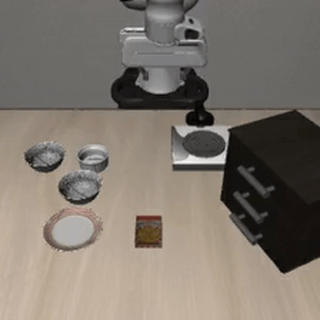
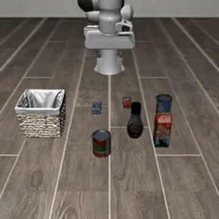
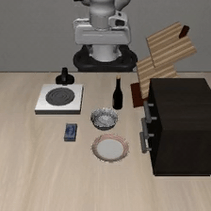
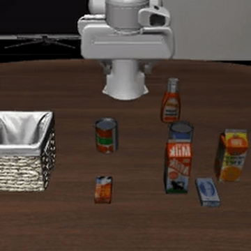

# Repository download
```bash
git clone https://github.com/wclee6314/RSLA.git
```
```bash
git submodule update --init --recursive third_party/openvla
```
```bash
git submodule update --init --recursive third_party/LIBERO
```

# Env setup (conda: openvla)
```bash
cd PATH_TO_RSLA
bash ./setup/openvla_setup.sh
```

# Download fine-tuned OpenVLA (==Prismatic-VLA) model via LoRA on four LIBERO task suites

### libero-spatial
```bash
HF_MODEL="openvla/openvla-7b-finetuned-libero-spatial"
LOCAL_DIR="/home/jovyan/model-wclee/${HF_MODEL#*/}"  
mkdir -p "$LOCAL_DIR"
hf download "$HF_MODEL" --local-dir "$LOCAL_DIR"
```

### libero-object
```bash
# 1) libero-object
HF_MODEL="openvla/openvla-7b-finetuned-libero-object"
LOCAL_DIR="/home/jovyan/model-wclee/${HF_MODEL#*/}"
mkdir -p "$LOCAL_DIR"
hf download "$HF_MODEL" --local-dir "$LOCAL_DIR"
```

### libero-goal
```bash
# 2) libero-goal
HF_MODEL="openvla/openvla-7b-finetuned-libero-goal"
LOCAL_DIR="/home/jovyan/model-wclee/${HF_MODEL#*/}"
mkdir -p "$LOCAL_DIR"
hf download "$HF_MODEL" --local-dir "$LOCAL_DIR"
```

### libero-10
```bash
# 3) libero-10
HF_MODEL="openvla/openvla-7b-finetuned-libero-10"
LOCAL_DIR="/home/jovyan/model-wclee/${HF_MODEL#*/}"
mkdir -p "$LOCAL_DIR"
hf download "$HF_MODEL" --local-dir "$LOCAL_DIR"
```

# Custom VLA model
Coming soon

# Deploy (evaluation)
|  |  |  |  |
|---|---|---|---|
| **libero-spatial** | **libero-object** | **libero-goal** | **libero-10** |

### libero-spatial
```bash
OPENVLA_PATH="/home/jovyan/workspace/RSLA/third_party/openvla"
MODEL_DIR="/home/jovyan/model-wclee"
cd OPENVLA_PATH
python experiments/robot/libero/run_libero_eval.py   --model_family openvla   --pretrained_checkpoint $MODEL_DIR/openvla/openvla-7b-finetuned-libero-spatial   --task_suite_name libero_spatial   --center_crop True --use_wandb True --wandb_project openvla_eval --wandb_entity wclee-korea-advanced-institute-of-science-and-technology
```

### libero_object
```bash
OPENVLA_PATH="/home/jovyan/workspace/RSLA/third_party/openvla"
MODEL_DIR="/home/jovyan/model-wclee"
cd OPENVLA_PATH
python experiments/robot/libero/run_libero_eval.py   --model_family openvla   --pretrained_checkpoint $MODEL_DIR/openvla/openvla-7b-finetuned-libero-object   --task_suite_name libero_object   --center_crop True --use_wandb True --wandb_project openvla_eval --wandb_entity wclee-korea-advanced-institute-of-science-and-technology
```

### libero_goal
```bash
OPENVLA_PATH="/home/jovyan/workspace/RSLA/third_party/openvla"
MODEL_DIR="/home/jovyan/model-wclee"
cd OPENVLA_PATH
python experiments/robot/libero/run_libero_eval.py   --model_family openvla   --pretrained_checkpoint $MODEL_DIR/openvla/openvla-7b-finetuned-libero-goal   --task_suite_name libero_goal   --center_crop True --use_wandb True --wandb_project openvla_eval --wandb_entity wclee-korea-advanced-institute-of-science-and-technology
```

### libero_10
```bash
OPENVLA_PATH="/home/jovyan/workspace/RSLA/third_party/openvla"
MODEL_DIR="/home/jovyan/model-wclee"
cd OPENVLA_PATH
python experiments/robot/libero/run_libero_eval.py   --model_family openvla   --pretrained_checkpoint $MODEL_DIR/openvla/openvla-7b-finetuned-libero-10   --task_suite_name libero_10   --center_crop True --use_wandb True --wandb_project openvla_eval --wandb_entity wclee-korea-advanced-institute-of-science-and-technology
```

# 리뷰 해 볼 만한 Physical AI 관련 페이퍼 리스트 
### 모델
- [OpenVLA] Kim, M. J., Pertsch, K., Karamcheti, S., Xiao, T., Balakrishna, A., Nair, S., Rafailov, R., Foster, E., Lam, G., Sanketi, P., Vuong, Q., Kollar, T., Burchfiel, B., Tedrake, R., Sadigh, D., Levine, S., Liang, P., & Finn, C. (2024). OpenVLA: An Open-Source Vision-Language-Action Model. http://arxiv.org/abs/2406.09246
- [PrismaticVLM] Karamcheti, S., Nair, S., Balakrishna, A., Liang, P., Kollar, T., & Sadigh, D. (2024). Prismatic VLMs: Investigating the Design Space of Visually-Conditioned Language Models. http://arxiv.org/abs/2402.07865
- [RT-2] Brohan, A., Brown, N., Carbajal, J., Chebotar, Y., Chen, X., Choromanski, K., Ding, T., Driess, D., Dubey, A., Finn, C., Florence, P., Fu, C., Arenas, M. G., Gopalakrishnan, K., Han, K., Hausman, K., Herzog, A., Hsu, J., Ichter, B., … Zitkovich, B. (2023). RT-2: Vision-Language-Action Models Transfer Web Knowledge to Robotic Control. http://arxiv.org/abs/2307.15818
- [RoboCLIP] Sontakke, Sumedh, et al. "Roboclip: One demonstration is enough to learn robot policies." Advances in Neural Information Processing Systems 36 (2023): 55681-55693.
- [ICanTellWhatIamDoing] Wang, Z., Liang, B., Dhat, V., Brumbaugh, Z., Walker, N., Krishna, R., Cakmak, M., & Allen, P. G. (n.d.). I Can Tell What I Am Doing: Toward Real-World Natural Language Grounding of Robot Experiences.

### 비쥬얼 인코더
- [DINOv2] Oquab, M., Darcet, T., Moutakanni, T., Vo, H., Szafraniec, M., Khalidov, V., Fernandez, P., Haziza, D., Massa, F., El-Nouby, A., Assran, M., Ballas, N., Galuba, W., Howes, R., Huang, P.-Y., Li, S.-W., Misra, I., Rabbat, M., Sharma, V., … Bojanowski, P. (2024). DINOv2: Learning Robust Visual Features without Supervision. http://arxiv.org/abs/2304.07193
- [CLIP] Radford, A., Kim, J. W., Hallacy, C., Ramesh, A., Goh, G., Agarwal, S., Sastry, G., Askell, A., Mishkin, P., Clark, J., Krueger, G., & Sutskever, I. (2021). Learning Transferable Visual Models From Natural Language Supervision. http://arxiv.org/abs/2103.00020
- [SigLIP] Zhai, X., Mustafa, B., Kolesnikov, A., Beyer, L., & Deepmind, G. (n.d.). Sigmoid Loss for Language Image Pre-Training. https://github.
- [VAST] Chen, S., Li, H., Wang, Q., Zhao, Z., Sun, M., Zhu, X., & Liu, J. (2023). VAST: A Vision-Audio-Subtitle-Text Omni-Modality Foundation Model and Dataset. http://arxiv.org/abs/2305.18500

### 데이터셋
- [OpenXEmbodiment] Embodiment Collaboration, O’Neill, A., Rehman, A., Gupta, A., Maddukuri, A., Gupta, A., Padalkar, A., Lee, A., Pooley, A., Gupta, A., Mandlekar, A., Jain, A., Tung, A., Bewley, A., Herzog, A., Irpan, A., Khazatsky, A., Rai, A., Gupta, A., … Lin, Z. (2025). Open X-Embodiment: Robotic Learning Datasets and RT-X Models. http://arxiv.org/abs/2310.08864